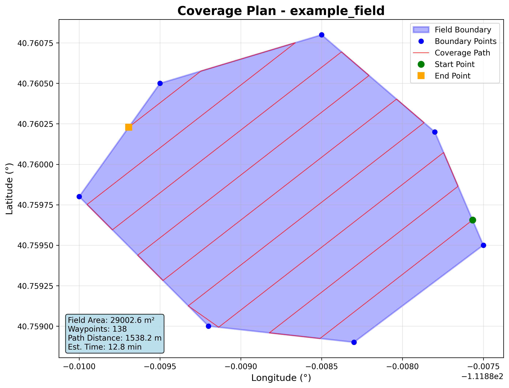

# 🚁 Field Coverage Planner

[](https://opensource.org/licenses/MIT)
[](https://www.python.org/downloads/)

**Advanced agricultural field coverage path planning system with intelligent optimization**



## 🎯 Features

- **🤖 Intelligent Direction Optimization**: Automatically finds the optimal coverage direction to minimize path length
- **⭐ Visual Feedback**: Star emoji marking shows optimal directions during optimization
- **🚀 User-Friendly CLI**: Run with default parameters or customize everything
- **📊 Complex Field Support**: Handles any polygon shape (tested with 7+ edge fields)
- **🔍 Configurable Precision**: Adjustable optimization step sizes (1° to 30°)
- **📈 Real-time Visualization**: Generates plots and statistics automatically
- **✅ Comprehensive Validation**: Built-in waypoint and field validation
- **🔧 Easy Installation**: Simple pip install with all dependencies

## 🚀 Quick Start

### Installation

```bash
# Clone the repository
git clone https://github.com/SDNT8810/field-coverage-planner.git
cd field-coverage-planner

# Install with pip
pip install -e .

# Or install dependencies manually
pip install -r requirements.txt
```

### Basic Usage

```bash
# Quick start with default example
field-coverage

# Use your own GPS field data
field-coverage your_field.csv output_waypoints.csv

# With custom parameters
field-coverage field.csv --swath-width 2.5 --overlap 0.15 --optimization-step 5
```

## 📋 Input Format

Your CSV file should contain GPS coordinates with `latitude,longitude` columns:

```csv
latitude,longitude
40.7128,-74.0060
40.7158,-74.0060
40.7168,-74.0040
40.7148,-74.0030
40.7138,-74.0040
40.7128,-74.0060
```

## 🛠️ Command Line Options

```bash
field-coverage [input_file] [output_file] [options]

Positional Arguments:
  input_file            GPS coordinates CSV file (default: data/example_field.csv)
  output_file           Output waypoints CSV file (default: output/coverage_result.csv)

Coverage Parameters:
  --swath-width FLOAT   Swath width in meters (default: 3.0)
  --overlap FLOAT       Overlap percentage as decimal (default: 0.1)
  --turn-radius FLOAT   Minimum turning radius in meters (default: 2.0)
  --speed FLOAT         Default waypoint speed in m/s (default: 2.0)

Optimization:
  --direction FLOAT     Fixed coverage direction in degrees (0=North, 90=East)
  --optimization-step   Step size for optimization in degrees (default: 15.0)
                       Smaller values = more precise but slower

Output Options:
  --plot               Generate visualization plot (default: True)
  --plot-output PATH   Plot output path (default: output/field_coverage_plot.png)
  --no-show-plot       Don't display plot window (default)
  --validate           Validate waypoints (default: True)
  --verbose            Enable verbose output (default: True)
```

## 📊 Example Results

The system automatically optimizes coverage direction and provides detailed statistics:

```
🔍 Optimizing coverage direction...
  Testing 12 directions (step: 15.0°)...
    Direction    0.0°:  11056.9m total path
    Direction   15.0°:  11039.9m total path
    Direction   30.0°:  11038.0m total path
    Direction   45.0°:  10989.0m total path ⭐
    Direction   60.0°:  11032.7m total path
    Direction   75.0°:  11055.4m total path
    Direction   90.0°:  11054.0m total path
    Direction  105.0°:  11012.3m total path
    Direction  120.0°:  11050.5m total path
    Direction  135.0°:  11039.3m total path
    Direction  150.0°:  11050.3m total path
    Direction  165.0°:  11041.7m total path
  Best direction: 45.0° with 10989.0m total path
✓ Optimal direction found: 45.0°

Field Area: 29,003 m² (2.9 hectares)
Generated: 1,117 waypoints
Total Distance: 10,989 m (11.0 km)
Estimated Time: 91.6 minutes
```

## 🏗️ Project Structure

```
field-coverage-planner/
├── src/field_coverage/          # Main package
│   ├── algorithms/              # Coverage algorithms
│   │   └── boustrophedon.py    # Boustrophedon pattern generator
│   ├── core/                   # Core classes
│   │   ├── field.py           # Field representation
│   │   ├── waypoint.py        # Waypoint sequences
│   │   └── coordinates.py     # GPS coordinate handling
│   ├── utils/                  # Utilities
│   │   ├── geometry.py        # Geometric calculations
│   │   └── validation.py      # Data validation
│   ├── visualization/          # Plotting and visualization
│   │   └── field_plotter.py   # Matplotlib-based plotting
│   ├── io/                     # Input/output handling
│   │   ├── csv_handler.py     # CSV file operations
│   │   └── ros_handler.py     # ROS integration (future)
│   ├── cli.py                  # Command line interface
│   └── main.py                 # Main planner class
├── data/                       # Example datasets
│   └── example_field.csv      # 7-edge polygon example
├── docs/                       # Documentation
│   ├── images/                # Documentation images
│   ├── IMPLEMENTATION_SUMMARY.md
│   ├── PROJECT_STATUS.md
│   └── TODO.md
├── examples/                   # Usage examples
├── tests/                      # Unit tests
├── requirements.txt            # Python dependencies
├── setup.py                   # Package setup
├── LICENSE                    # MIT License
└── README.md                  # This file
```

## 🧪 Development

### Running Tests

```bash
# Run basic tests
python -m pytest tests/

# Test with your own field data
python test_optimization.py
```

### Contributing

1. Fork the repository
2. Create a feature branch: `git checkout -b feature-name`
3. Make your changes and add tests
4. Commit your changes: `git commit -am 'Add feature'`
5. Push to the branch: `git push origin feature-name`
6. Submit a pull request

## 📚 Algorithm Details

### Boustrophedon Pattern
- Generates parallel coverage paths with U-turns at field boundaries
- Intelligent direction optimization minimizes total path length
- Handles complex polygon shapes with obstacle avoidance
- Configurable overlap and swath width for different applications

### Optimization Process
1. **Direction Testing**: Tests multiple directions (configurable step size)
2. **Path Generation**: Creates boustrophedon pattern for each direction
3. **Distance Calculation**: Measures total path length including turns
4. **Best Selection**: Chooses direction with minimum total distance
5. **Visual Feedback**: Marks optimal direction with star emoji ⭐

## 🔧 Requirements

- Python 3.8+
- NumPy
- Matplotlib
- Shapely
- Click (for CLI)

## 📄 License

This project is licensed under the MIT License - see the [LICENSE](LICENSE) file for details.

## 👨‍💻 Author

**Davoud Nikkhouy** (@SDNT8810)
- Email: davoudnikkhouy@gmail.com
- GitHub: [SDNT8810](https://github.com/SDNT8810)

## 🙏 Acknowledgments

- Built for agricultural automation and precision farming applications
- Supports UAV/drone path planning workflows
- Compatible with various field management systems

---

⭐ **If this project helps you, please give it a star!** ⭐
